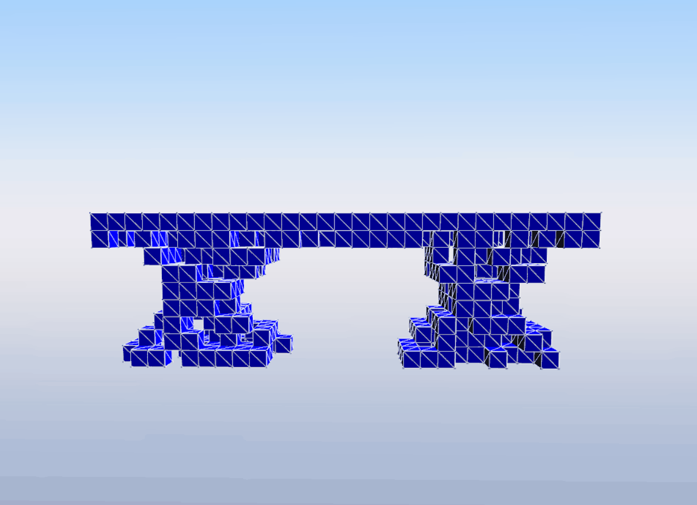
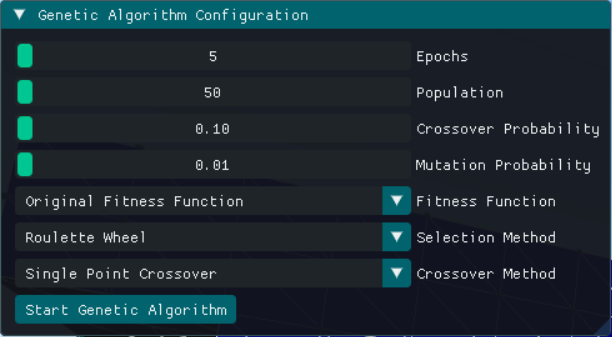
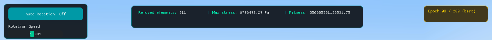
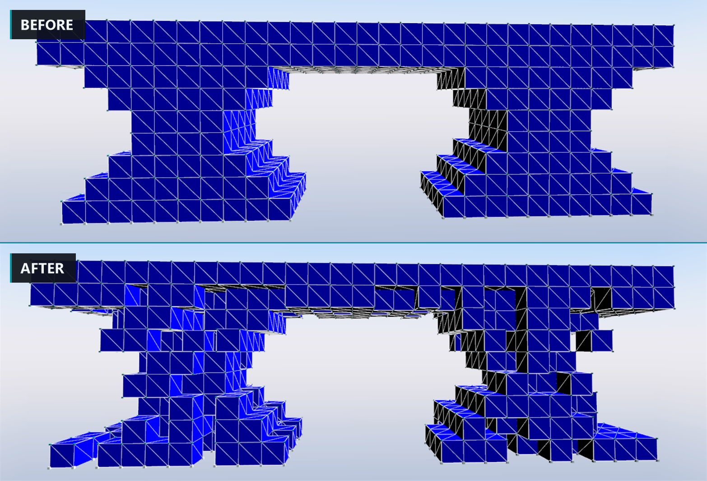

# Structural Optimization with a Genetic Algorithm

A desktop app that takes a 3D structure, removes as much material from it as it can, and checks after every change that the thing is still standing. The structure is simulated with [Project Chrono](https://projectchrono.org/), so "still standing" means an actual stress simulation and not a guess.

## Preview



## How It Works

The structure lives on a grid of cubes, `OX_SIZE` by `OY_SIZE` by `OZ_SIZE`. Every cube is either there or not there, so the whole structure is just a list of ones and zeros, one per cube. That list is what the genetic algorithm works on.

A run starts from the structure in `initial_individual.txt` and makes a population of copies of it. Each copy is an *individual*. Over a number of epochs the algorithm keeps the good ones, mixes them, flips a few cubes at random, and repeats.

### Testing a structure

To find out if an individual is any good, it gets rebuilt as a real mesh and simulated. Every filled cube becomes an eight-node hexahedral element, the cubes at the bottom are tied to a fixed base, and Chrono runs the dynamics with an Euler-implicit-linearized timestepper and a MINRES solver. Then every element is asked for its principal stresses, and the largest one found anywhere in the structure is the number we care about.

If that stress goes over `MAXIM_STRESS`, the individual is treated as a failure and gets the lowest possible score. Everything else is scored on how much material it managed to drop.

### Scoring

There are four fitness functions to pick from, and they trade material against safety differently:

| Fitness function | What it does |
|---|---|
| Original | `(removed + 1)² × (maxStress − stress)`. Pushes hard on removing cubes. |
| Efficiency Ratio | `removed / stress`. Punishes any rise in stress. |
| Exponential Penalty | `removed × e^(−stress / maxStress)`. Gentler than Original. |
| Multi Objective | Half material saved, half safety margin, both scaled to 0–1. |

The top layer of the structure is never removed. Otherwise the algorithm would quickly work out that the cheapest way to lower stress is to delete the deck and leave the supports holding up nothing.

### The genetic algorithm

Each epoch does the same four things:

1. **Score** every individual by simulating it through a fitness function.
2. **Select** which ones survive. Four methods: Roulette Wheel, Tournament, Ranked, Stochastic Universal Sampling.
3. **Crossover** pairs of survivors. Four methods: Single Point, 3D Block, 2 Point Planar, Symmetry Forced. 
4. **Mutate**, which flips a few cubes at random.

The Genetic Algorithm configuration is done from a panel right after running the app.



*Epochs, population size and the two probabilities are sliders. The three dropdowns pick the fitness function, the selection method and the crossover method.*

### Looking at the results

When the run finishes the app switches to a viewer that holds the best individual from every epoch. You can step through them one at a time, ten at a time, or jump to the first or last.



*Left: camera controls. Middle: how many cubes were removed, the highest stress in the structure, and the fitness score. Right: which epoch you are looking at, gold because this one is the best of the run.*



*The same bridge before and after a short run. The deck on top is untouched because the top layer is protected. Everything under it got thinner.*

## Key Features

* Real stress simulation behind every decision, using Chrono's FEA, instead of a scoring heuristic;
* Four fitness functions, four selection methods and four crossover methods, all swappable from the UI without recompiling;
* Symmetry-forced crossover for structures that are meant to be symmetric;
* Parallel fitness evaluation, capped to the number of cores so it does not thrash;
* Epoch viewer that keeps every generation's best structure, so you can step back through the whole run;
* The best epoch is found and marked automatically, since it is often not the last one;
* Free camera with auto-rotation, and a key to hide the whole UI for a clean look at the structure;
* Results written to `final_individual.txt` and `individual_values.csv` so you can plot a run or reload it.

## Tech Stack

* Language: C++20
* Physics and FEA: Project Chrono 7.0.3
* Rendering: Irrlicht 1.8.5, through Chrono's `chrono_irrlicht` module
* UI: Dear ImGui 1.90.9 on the DirectX 9 backend, vendored in `inc/Imgui` and `src/Imgui`
* Build: CMake 3.21+, Visual Studio 2022

Windows only. The ImGui integration talks directly to the Irrlicht device's Direct3D 9 device, so there is no portable path.

## How To Run The Application

### Prerequisites

* Windows
* [Visual Studio 2022](https://visualstudio.microsoft.com/downloads/) with the **Desktop development with C++** workload
* [CMake 3.21 or newer](https://cmake.org/download/) — Visual Studio already ships one, so you only need this if you want the standalone GUI

Chrono is not something you install, you build it. That is most of the work below.

### 1. Download the libraries

| What | Where | Notes |
|---|---|---|
| Project Chrono 7.0.3 | [github.com/projectchrono/chrono/releases](https://github.com/projectchrono/chrono/releases) | Source only. Take the 7.0.3 tag, newer versions changed the API. |
| Eigen 3.4.0 | [eigen.tuxfamily.org](https://eigen.tuxfamily.org/index.php?title=Main_Page) | Header only, nothing to build. |
| Irrlicht 1.8.5 | [irrlicht.sourceforge.io](https://irrlicht.sourceforge.io/?page_id=10) | Ships with prebuilt Win64 binaries, nothing to build. |

Unpack all three somewhere sensible and leave them there. Chrono writes these paths into its own config file, so if you move them later the build breaks.

### 2. Build Chrono

Open the CMake GUI and set:

* **Where is the source code:** the unpacked `chrono-7.0.3` folder
* **Where to build the binaries:** a new empty folder next to it (e.g. `chrono-build`)

Press **Configure**, pick **Visual Studio 17 2022** and **x64**, then fill in:

| Variable | Value |
|---|---|
| `EIGEN3_INCLUDE_DIR` | the Eigen folder, the one containing `signature_of_eigen3_matrix_library` |
| `ENABLE_MODULE_IRRLICHT` | `ON` |
| `IRRLICHT_ROOT` | the Irrlicht folder, the one containing `include` and `lib` |

Press **Configure** again until no rows are red, then **Generate**.

Open `chrono-build/Chrono.sln` in Visual Studio, pick the **Release** configuration and build `ALL_BUILD`. Build **Debug** too if you want to debug this project later.

### 3. Clone and build this project

```bash
git clone https://github.com/RazvanSpataru05/Final-Siemens-Challenge.git
```

Point CMake at your Chrono build. The folder you want is the one holding `ChronoConfig.cmake`, which for a Chrono build tree is `chrono-build/cmake`:

```bash
cmake -S . -B build -G "Visual Studio 17 2022" -A x64 -DChrono_DIR="C:/path/to/chrono-build/cmake"
```

```bash
cmake --build build --config Release
```

If you would rather not type the path every time, set a `CHRONO_DIR` environment variable and use the bundled preset instead:

```bash
cmake --preset windows-x64
```

```bash
cmake --build --preset release
```

There is also `CMakeUserPresets.json.example`. Copy it to `CMakeUserPresets.json` and put your path in there. That file is gitignored, so it stays on your machine.

The build copies `Irrlicht.dll` and the `ChronoEngine*.dll` files next to the executable for whichever configuration you built, so there is nothing to copy by hand.

### 4. Run it

Open `build/ChronoProject_FinalGA.sln` and press **F5**, or just run the executable:

```bash
build/Release/ChronoProject_FinalGA.exe
```

It does not matter what folder you run it from. CMake compiles the project path into the binary, so the app always finds its input files and always writes its output next to them.

## Configuration

### `algorithm_settings.txt`

Read once when the app starts. This is the problem itself, the shape of the grid and what the material is made of.

| Key | Meaning |
|---|---|
| `OX_SIZE`, `OY_SIZE`, `OZ_SIZE` | Grid size, in cubes |
| `ELEMENT_SIZE` | Edge length of one cube, in meters |
| `MAXIM_STRESS` | Stress the structure is not allowed to go over, in Pa |
| `YOUNG_MODULUS`, `POISSON_RATIO`, `DENSITY` | Material properties |

### `initial_individual.txt`

The structure you start from. Exactly `OX_SIZE * OY_SIZE * OZ_SIZE` values, each `0` or `1`, separated by spaces or newlines. `1` means the cube is there.

The values are read bottom layer first. Inside a layer they go row by row along Z, and inside a row along X. Writing the file with one row per line makes it much easier to read.

## Using The App

Set up the run in the panel, press **Start Genetic Algorithm**, and wait. The console acts as a logger, so it prints when an individual has been created, or how many epochs have been run so far.

When it finishes, the viewer opens on the best epoch.

### Controls

| Key | Action |
|---|---|
| `H` | Show or hide the UI panels |
| `R` | Reset the camera |
| `Space` | Toggle camera auto-rotation |
| `A` / `D` | Rotate the camera left / right |
| `Esc` | Close the window |

## Troubleshooting

**`Could not find Project Chrono (7.0.3) or its Irrlicht module`**
`Chrono_DIR` is wrong. It has to point at the folder that *contains* `ChronoConfig.cmake`, not at the Chrono root.

**`the include path it records does not exist`**
You moved the Chrono source or build folder after building it. Chrono writes absolute paths into `ChronoConfig.cmake` and they do not survive being moved. Either put the folders back, or build Chrono again where they are now.

**The window opens but the structure is empty**
`initial_individual.txt` is missing or too short. It needs exactly `OX_SIZE * OY_SIZE * OZ_SIZE` values. If it has fewer, the rest are read as empty and you get nothing.

**Missing `ChronoEngine.dll` or `Irrlicht.dll` when starting**
Rebuild, or copy them yourself from `chrono-build/bin/Release` next to the executable. Do not mix Debug and Release DLLs.

## Project Background

This application was developed as a team project by [Spătaru Răzvan-Gabriel](https://github.com/RazvanSpataru05), [Stoica Anna Maria](https://github.com/MariaStoica23) and [Vieru-Potecu Cezar-Mihai](https://github.com/vcezar47) for **Siemens Curious Minds Spring School 2026**, starting from a handed out template project.

## License

This project is licensed under the [MIT License](LICENSE).
